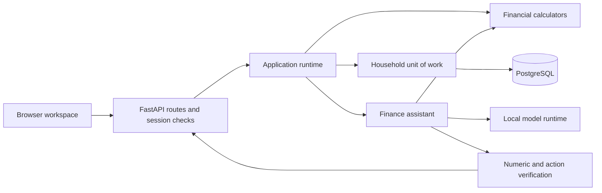

# FinPilot architecture

FinPilot is a modular monolith: a single Python application serves the browser, authenticated APIs, deterministic financial engines, and an optional local language model. PostgreSQL is the hosted system of record. SQLite supports local development and isolated tests.

## Request and data flow

`finpilot/api/` owns HTTP validation, identity dependencies, and response handling. `finpilot/runtime.py` owns workspace loading, transactions, revision-aware caching, and answer persistence. `finpilot/engine/` owns calculations using domain records and decimal money. `finpilot/execution/` owns payment states, preflight checks, mandates, and provider interaction. `finpilot/ai/` selects calculators, explains their results, and verifies generated prose. `finpilot/persistence/` owns relational records and the versioned domain codec. `finpilot/integrations/` owns the operator-configured Plaid adapter; it imports bank reads without granting payment capabilities.

These boundaries permit the application to scale as one service while keeping money movement and authentication independent of presentation or model behavior. A microservice split would add coordination and deployment cost without improving the current workload.

## Persistence and tenant boundaries

| Record | Purpose |
| --- | --- |
| `users` | Unique email identity and Argon2 password hash. |
| `households` | Authoritative domain snapshot, current revision, and update time. |
| `memberships` | User access to a household and its role. |
| `sessions` | Hashed opaque session token and expiration. |
| `transactions` | Indexed transaction projection for account activity queries. |
| `audit_events` | Actor, action, household revision, and time of a committed change. |
| `assistant_answers` | User/household-bound answer, evidence, and source revision. |
| `rate_limits` | Shared counters for authentication, assistant, and bank-operation limits. |
| `bank_connections` | Household-scoped provider item, encrypted access token, account-ID mapping, sync cursor/version, and connection status. |

Each household is an aggregate. Its persisted JSON snapshot retains accounts, obligations, policies, reserves, execution groups, and shared mandate identity. The codec records decimals, dates, enums, dataclasses, and references using an allowlist and a schema version; it does not use pickle or dynamic imports from payloads.

The indexed transaction table is a read projection, keyed by household and transaction ID, with an index on household, account, and posting date. Updates to the projection commit with the authoritative snapshot. This avoids a distributed dual-write problem. The snapshot still contains transaction history, so decoding and snapshot writes grow with that history; very large households may eventually justify separating immutable ledger records from the aggregate.

A request derives its tenant from a validated session and current membership. A supplied household or account ID never grants access. The assistant's account/page context is a viewing hint within the authorized household, not a replacement authorization boundary. Several household-wide calculators intentionally read across accounts.

## Writes and consistency

A mutation runs in one SQLAlchemy unit of work:

1. Verify the actor's membership and allowed role.
2. Lock the household and membership rows with PostgreSQL `SELECT ... FOR UPDATE`, then check the current role.
3. Compare an optional `If-Match` revision with the stored revision.
4. Decode a private domain snapshot, run the operation, and serialize the result.
5. Update the row with a revision predicate, synchronize only added/changed/deleted transaction projection records, and append the audit event in the same database transaction.
6. Publish the new revision and invalidate cached household views after a successful commit.

The PostgreSQL row lock serializes household writers across processes. The revision predicate also protects stale browser tabs. The local process uses bounded household lock stripes for SQLite and same-process coordination. SQLite is a development backend; it does not provide PostgreSQL row-lock semantics.

ORM sessions belong to individual requests or units of work. No global SQLAlchemy session or mutable household is shared between users. Uncached reads decode private snapshots. Dashboard cache keys include household, revision, and financial as-of date. Bootstrap uses a separate bounded cache of immutable response data: every hit first verifies membership and reads the current database revision, so another process's commit invalidates the old view without loading the large snapshot. The cache also includes the calendar date for live planning rollover. Returned values are copied; model status is appended dynamically. Only the 100 most recent transactions are projected into bootstrap/workspace responses. AI inference runs outside financial transaction locks.

## Authentication and browser security

Passwords use Argon2 hashes. Sign-in creates a random, revocable, 12-hour opaque session; only its hash is stored. The browser receives an HttpOnly, SameSite=Lax cookie, with Secure enabled for hosted HTTPS operation. Logout deletes the persisted session.

Authenticated mutations require the session-derived CSRF token and same-origin checks. Registration and login also check origin and apply database-backed throttling. Hosted startup requires a PostgreSQL URL and an HTTPS public origin. Trusted-host checks, framing restrictions, no-store API responses, and HTTPS response headers are applied at the HTTP boundary.

Authentication here is email/password sign-in; it does not imply email ownership verification, MFA, or account recovery integrations. Those are separate product capabilities.

## Bank connection and synchronization

Plaid linking is inactive until the operator supplies valid environment settings and a Fernet encryption key. Access tokens are encrypted at rest and never included in browser responses, request logs, or financial snapshots. The frontend receives only the short-lived Link token; an OAuth redirect can resume Link using session storage tied to the current signed-in user. Credentials remain server-side.

This adapter requests Transactions and imports checking, savings, and money-market deposit accounts. It deliberately does not construct credit-card or loan terms from a balance; those records use the existing manual entry flows. Missing current/available balances are not replaced with invented values. Previously imported accounts whose current snapshot is missing or incomplete retain their last recorded balances with stale provenance and an unhealthy connection.

The adapter uses cached account balances: `last_synced_at` is retrieval time, while the bank balance's effective timestamp remains unknown. It does not claim real-time freshness, ownership verification, deposit protection, or payment authority. This follows the distinction documented for [Plaid Accounts](https://plaid.com/docs/api/accounts/).

Provider HTTP calls finish before a financial unit of work begins. A sync captures the connection's version/cursor, fetches all pages, then locks and rereads the owned connection inside the household UoW. A changed version/cursor rejects the stale result. Domain accounts, transactions, indexed projections, next cursor, and audit event commit together. A provider or database failure does not advance the cursor.

Provider IDs are namespaced by connection. Repeated changes update existing records. A posted transaction can point to its previous pending row; the old pending row and removed rows are retained as reversed audit history and excluded from spending. Imported pending amounts are marked as already represented by the bank's available snapshot, avoiding a second forecast deduction. If a provider reports a pagination mutation, the adapter restarts the entire batch at its saved cursor. Protocol details are described in [Plaid transaction data](https://plaid.com/docs/transactions/transactions-data/) and [sync errors](https://plaid.com/docs/errors/transactions/).

Disconnect explicitly asks the provider to revoke the item, then clears the encrypted token and marks retained balances stale. It does not delete financial records. An in-flight sync cannot restore a disconnected connection because the version check fails. A provider failure is reported without claiming successful revocation. Creating a remote grant and committing local storage cannot form one atomic transaction. Failed exchanges do not automatically revoke the remote item, because another worker may have successfully saved that same grant. Only explicit Disconnect invokes item removal. The failure response says the link attempt was not saved and asks the user to review Connections and provider authorization; uncertain grants need provider/operator reconciliation. A durable per-item exchange-claim/recovery protocol is not yet implemented.

Sync is initiated by the user; scheduled sync, bank webhooks, update-mode institution recovery, and automatic account merging across separate connections are not implemented. Do not repeatedly link the same account to refresh it; use Sync. The adapter has only been exercised with mocked provider responses. No Sandbox or Production credentials, real bank information, or live provider requests were used in validation.

## AI latency and financial correctness

Straightforward questions use the deterministic router and calculators. A bounded capability planner handles broader requests and compounds; generated plans can prepare actions for review but cannot execute them. The original numeric grounding, unsupported-action checks, untrusted-content checks, and scenario labels remain in the answer path. Empty, malformed, truncated, unavailable, or rejected model responses fall back to calculator wording with `used_model=false`.

The legacy financial tool-selection path is restricted to tools explicitly marked read-only. The schema list excludes mutation tools, and execution independently rejects fabricated or unclassified names. The legacy function-calling route stays read-only. Pause, skip and payment preparation are available through the reviewed executor described below. Shared argument validation rejects malformed types, nonfinite numbers, oversized strings, and out-of-range dates/durations before calculations begin. If a model selects unrelated evidence, the deterministic routed result remains the primary answer source and controls its template/state.

Numeric checks recognize currency symbols, currency words/codes, percentages, and thousand/million/billion shorthand. Numeric IDs, account masks, and free-form metadata cannot authorize monetary claims; positive constants also require evidence. These checks are not semantic verification: they can still miss a supported value assigned to the wrong metric, a reversed comparison, or a missing caveat. The tool result and its source assumptions remain available for review; generated prose is not guaranteed correct merely because numeric checks pass.

Legacy model-selected function schemas include only explicitly classified read-only tools. An independent execution check rejects invented mutation names, malformed arguments and excessive forecast horizons before invoking a calculator. The default router and dedicated authenticated write endpoints retain their explicit action paths. A selected tool cannot substitute a payload of a different shape into the routed answer template.

The session validates the viewed account before passing its ID as a default to account-specific tools; card utilization resolves the associated card record. This is a viewing context, not a new authorization grant. Answers and their evidence are saved per user and household. Conversations now persist per user and household. The six most recent completed turns provide bounded context; read-only follow-up parameters are resolved and calculators rerun against fresh data.

MCP is implemented through the official Python SDK: a stdio bridge exposes authenticated read-only financial tools, while approved Streamable HTTP sources can be imported into private document retrieval. Configuration, credential scope and protocol limits are documented in [MCP.md](MCP.md). Plaid remains a direct REST integration.

Latency controls are deliberately separate from calculation correctness:

- Model discovery runs in a background startup task. Financial reads use `LocalLLM.status()`, which performs no network I/O.
- Health observations cache positive and negative results for 15 seconds. Concurrent health probes share one request; explicit operator refreshes can bypass the TTL.
- Chat and health calls reuse one thread-safe HTTP client. Closing a client stops new calls and releases the pool after active requests complete.
- A failed completion starts a five-second retry cooldown. Calculator answers continue during that interval.
- The default inference budget is 12 seconds with at most 384 output tokens. Environment overrides are supported, capped at 120 seconds and 2,048 tokens. Tool-calling and composition share the remaining budget; the HTTP client's connection and pool waits are bounded separately.
- The runtime uses `FinanceAgent(..., compile_graph=False)` for request-bound snapshots. This executes the same six guarded phases directly and avoids compiling a bound graph for every request.
- AI admission is bounded per application process. Requests beyond the available slots receive a retryable busy response rather than building an unlimited queue.

These are latency controls, not a promise of instantaneous AI. Actual model time depends on hardware, cold loading, context length, and concurrent work. HTTP timeouts limit network waiting; they are not a hard real-time guarantee against every possible slow server response. No unverified token stream is shown as a financial answer.

A local 30-run calculator benchmark measured median new-agent-plus-query time of approximately 12.35 ms with graph compilation and 1.43 ms with direct execution. This excluded live model inference and hosted database/network time. The health regression test reduced five successive refreshes to one probe, while status reads made no requests.

## Operations and current boundaries

Alembic owns hosted schema changes. Local development may initialize tables automatically. The application should start against a migrated PostgreSQL database in production; a separate release job runs migrations once before application workers start.

Requests include a request ID and `Server-Timing` header. Request logs exclude bodies, questions, credentials, amounts, and query strings. Audit records capture financial state changes separately from operational logs.

Payment execution uses a simulated provider and is available only in a workspace explicitly created with sample data (`payment_sandbox=true`). Bank-link creation rejects these sample workspaces. Run/recover simulation endpoints reject real workspaces; bank imports receive balance/activity read capabilities only. The immutable sample boundary keeps simulations from changing imported bank balances. There is no production payment rail.

Email/password registration and sessions are implemented, but email ownership verification, MFA, self-service recovery, and email delivery are not. There is no claim that those services are configured. Deployment-specific monitoring and identity requirements remain operator decisions.

PostgreSQL supports multiple application processes, but the dashboard cache, model health cache, and AI concurrency slots are per process. A shared model gateway or external admission queue may be needed when scaling inference beyond one host. No financial answer is cached independently of its household revision.

## Repeatable latency evidence

`scripts/benchmark.py` creates disposable SQLite databases, registers authenticated sample workspaces, imports 5,000 synthetic transactions through the CSV API, and measures supported create/read/update routes. All model traffic uses `httpx.MockTransport`; no bank or model service is contacted. It also holds an inference response pending and asserts a same-household financial read and write finish before releasing it.

The September 11, 2026 local run (12 repetitions, Python 3.12 / Windows 11) measured 5,000-row bootstrap medians of 132 ms with application caches cleared and 16 ms with caches populated. Indexed first-page history was 6 ms; account updates were 262 ms. The full results, measurement definitions and command are in README's latency section; `--output` saves individual samples as JSON.

The optimization deliberately keeps the aggregate consistency boundary. It avoids encoding thousands of transactions that would be omitted from the response and avoids reading the complete SQL transaction projection for unrelated edits. Scalar transaction field snapshots detect in-place provider corrections before committing projection changes. Aggregate JSON decoding/encoding remains proportional to history size, and deep offset pagination grows with offset. These local ASGI timings exclude browser, network and hosted PostgreSQL effects; separating historical ledger storage from the mutable aggregate is a future scaling step, not a capability claimed by this benchmark.

## Browser asset updates

The root document uses one content fingerprint for its CSS and JavaScript URL prefix. Relative imports therefore stay inside the same version, preventing an updated entry module from loading an old assistant or state module from browser cache. Static responses revalidate with `Cache-Control: no-cache`; the legacy `/assets/` path remains available. The fingerprint is established on process startup, so restart application workers after changing web assets. Rolling deployments still need consistent artifact delivery at the hosting layer.

The current workflow, local-model and AI/MCP validation results are documented in [AI_VALIDATION.md](AI_VALIDATION.md).

## Conversation and source persistence

`conversations` owns tenant/user scope, selected document IDs, viewing context, title, version and a short generation lease. `conversation_generations` assigns an addressable answer ID before inference and tracks pending/completed/failed/interrupted states, timestamps, response evidence and model usage when supplied by the local runtime. The existing answer history remains compatible. Deleting a conversation removes its generations and matching legacy history entries.

A conditional database update acquires the conversation lease; a second simultaneous request receives 409. No database session or transaction remains open during inference. A 180-second lease recovers abandoned requests. Completion checks that its generation still owns the lease. Current financial inputs are read fresh; prior model text and documents cannot authorize a mutation. Short conversational requests can reuse only an explicitly read-only calculator with validated changed parameters. Explicit remember statements are acknowledged immediately and scoped to that conversation.

Documents are private to a user within a household. Uploads accept UTF-8 TXT/Markdown and text-bearing PDF; source bytes are discarded after text extraction. PDF parsing runs in a bounded subprocess. Content hashes deduplicate private uploads. Chunk/term postings support indexed lexical BM25-style search without embedding inference or a vector service. Up to ten selected sources, six retrieved excerpts and six recent turns bound the model context. Summary requests can read bounded opening excerpts from selected documents; this is not a complete long-document summary.

Retrieved passages are untrusted. The model selects full candidate passages; the server accepts only exact matches, preserves source/page/chunk citations and visibly marks truncated excerpts. Invalid selections fall back to ranked extracts. This avoids treating document numbers as verified balances. Retrieval supports lexical matching, not semantic embeddings or OCR. Deleting a document removes its chunks and term postings; previous chat quotations remain until the corresponding conversation is deleted.

Private data is not placed in browser local storage. Conversation URLs contain an opaque ID and still require authentication. PostgreSQL migrations 0003 through 0005 add document, conversation/generation and MCP tables; local SQLite initialization creates the same new tables. A shared database is required for hosted replicas; model/MCP admission limits remain per worker.

The conversation lease also compares the version read with inherited context, rejecting an interleaved stale request before it can overwrite newer selections. Saved follow-up routes contain language parameters, while account/card identifiers are selected again from the current view. Legacy routes with injected identifiers are rebound on use. MCP setup metadata separates local read-grant availability from external-source configuration and never exposes server paths or credentials.

## Reviewed AI workflows

The typed catalog in finpilot/ai/capabilities.py declares 80 capabilities: calculator and record reads, local edits, private source changes, provider imports, navigation and secure handoffs. Each specifies bounded JSON Schema inputs, result format, required role/scope, availability and review requirements. Authenticated discovery adds user-owned record choices without credentials.

POST /api/ask preserves its previous fields and adds parts, workflow, explanation and action receipts. Structured parts contain authoritative financial results, source references, clarification controls, navigation, handoffs and proposal references. The AI workspace and contextual drawer share the same conversations and rendering modules. Structured workflow controls work when language inference is unavailable.

The planner shortlists capabilities, makes at most one schema-constrained planning call and validates the returned names and arguments against the full catalog. It accepts at most four operations. Explicit compound requests use required, ordered task slots so one task cannot be silently dropped or leak its filters into another; the slots normalize to the existing operations array before execution. Generated SQL, arbitrary URLs, code, confirmation capabilities and unclassified mutation tools are never executable. Explicitly requested writes produce proposals; retrieved text and conversational agreement cannot confirm them. Independent reads complete while missing inputs are clarified. Corrections revise a pending proposal without creating a second execution identity.

Workflow planning uses at most one model call within the shared 12-second inference budget. Request-specific schemas shortlist relevant fields and tenant-owned record labels, preserve explicit decimal values, convert percentage units, and omit unrequested defaults. Missing required values become server-owned clarifications. Clear commands and recognized compound reads use deterministic routes with no inference. Workflow explanations render verified server results without a second generic introduction call; legacy calculator and document explanation guards remain active. The API reports planner interpretation, explanation acceptance, model usage and fallback separately.

### Local consistency

Financial commands are shared by conventional screens and chat. Preview executes the same commands on a detached snapshot and shows before/after fields, regenerated expected paychecks, cleared mandates and planning-only allocations. Opaque generated IDs and timestamps are server assigned; receipts contain committed identities.

Migrations 0006-0008 add proposals/receipts, pending workflow state and private CSV attachments. Proposals bind user, household, conversation, canonical arguments, financial revision, displayed version and a 15-minute expiry. Confirmation accepts only identity/version. Editing or refreshing increments the version. Pending workflows survive beyond the six-turn language context.

Execution rechecks membership, role, ownership, current revision, planning date, expiry and prerequisites. Local batches and receipts commit in one Runtime.transaction. Conditional claims and a receipt primary key enforce one execution identity. Duplicate confirmations return the original receipt; stale previews require refresh. Saved answers receive receipts and the UI refreshes affected data.

Private deletions share ownership validation with conventional controls. CSV data lives in a conversation-owned immutable attachment. The normal parser checks mapping, limits, duplicates and balance-preserving imports; chat can resolve only an attachment belonging to the same user, household and conversation.

### Provider boundaries

Provider operations are separate from atomic local batches. A durable claim commits before remote work, with a three-minute abandoned-operation lease. Bank version, cursor and revision checks remain active. Failures/interrupted operations become outcome_unknown and are never automatically retried. External effects cannot be rolled back by the local database; uncertain outcomes require inspection and a fresh review.

Network calls and inference run outside database transactions. MCP uses the actual SDK with operator-approved servers, tools and resources. Credentials and once-shown grants stay in dedicated secure forms.

The modular monolith retains its per-household aggregate consistency boundary. Hosted production requires PostgreSQL. Local SQLite concurrency/migration tests and PostgreSQL DDL compilation do not establish hosted load or locking behavior; deployment-database verification remains outstanding.

The planner builds record context only for relevant entity kinds; unrelated transaction history is not materialized. MCP imports validate the configured source and tool allowlist both before showing a preview and before claiming execution. A known revoked-configuration error leaves the proposal unexecuted; failures after remote work starts still use the durable uncertain-outcome path.

Current end-to-end verification, PostgreSQL checks and measured local inference/API latency are recorded in [END_TO_END_VALIDATION.md](END_TO_END_VALIDATION.md).
