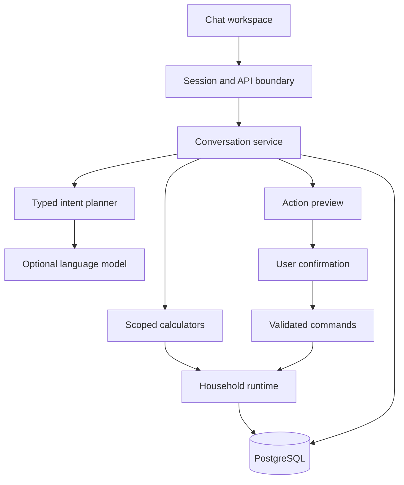
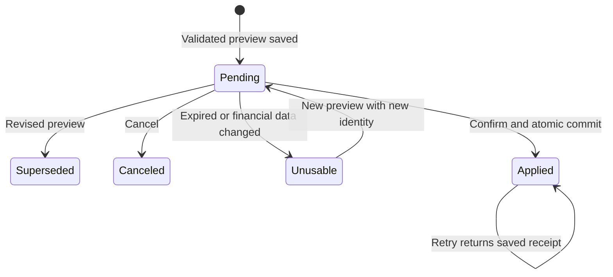
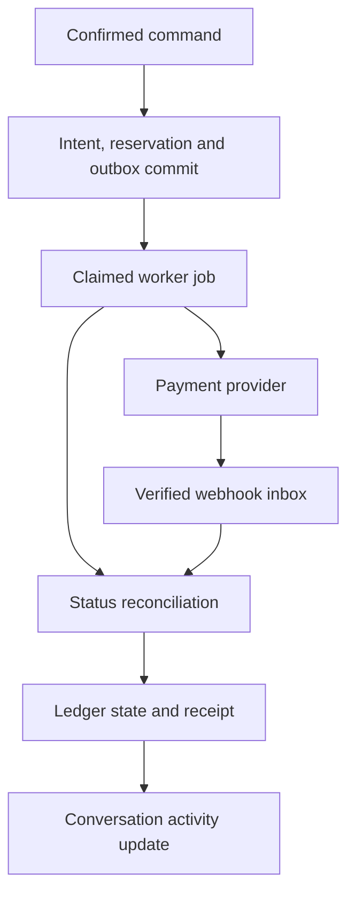

# FinPilot: the conversation is the financial workspace

Product review and target architecture · September 13, 2026; core priorities clarified September 14, 2026

Reviewed baseline: [`3a2bdc9`](https://github.com/imvenkat178/FinPilot/commit/3a2bdc9b01a1c860ff086236308fad57966336d7). Implementation branch: `codex/conversational-finance`. Read [IMPLEMENTATION_PLAN.md](IMPLEMENTATION_PLAN.md) for the ordered engineering tasks, local commands, acceptance scenarios and release checks.

## 1. Product definition

The two primary outcomes are **growth-aware routing among the user's existing accounts, with opted-in transfers**, and **a single FinPilot payment credential that routes supported purchases to the eligible existing card with the best expected net benefit**. AI chat configures and controls both. The [core money and card routing specification](CORE_MONEY_AND_CARD_ROUTING.md) defines these priorities, the distinction between contributions and earnings, and the US card-program dependencies. Bills, debt, mortgage and other features below support these outcomes.

FinPilot lets a person understand and manage their financial life through a continuing AI conversation. The user can ask a question, narrow it to one platform or account, request a chart, change the plan, review the exact change, and apply it in the same conversation. Account pages and dashboards remain useful supporting views.

The complete product includes execution: moving money, paying supported bills, and running explicitly authorized recurring allocations. A recommendation becomes a draft, a reviewed command, a provider submission and a reconciled result. Those are different states and must remain visible.

The financial universe is the user's existing accounts, cards, obligations and portfolios. Connecting or recording an existing account is supported. The app must not select new securities, sell holdings, automatically open financial accounts or recommend an external investment account as a solution. The user's September 14 clarification explicitly adds enrollment in a FinPilot routing credential for supported existing cards; its issuing form and terms require separate consent. Sending cash to an existing brokerage is different from buying an investment. Employer retirement contributions may require payroll changes and cannot be represented as ordinary bank transfers.

US consumer finance is the first delivery path. The same ownership, permission and cash-flow model should later support complex households, trusts and business entities. HNW features add verified entity and collateral rules; they do not require a separate chat product.

**Release distinction:** this branch implements a working conversation foundation over the existing financial application. Live payment rails, exact allocations on each actual deposit, background automation, and comprehensive financial-data integrations remain engineering work. The interface states these limits.

## 2. Review of the existing work

The latest main branch already has substantial useful infrastructure: authenticated users and sessions, household membership, persistent SQLAlchemy records, PostgreSQL transaction boundaries, Alembic migrations, financial calculators, recurring obligations, an execution simulator, a read-only Plaid adapter and a large test suite. Replacing that with a new stack would discard working domain behavior.

The largest product gap was the assistant interaction model. A contextual question box and saved answers do not provide a durable workflow for editing a plan over several turns. A reliable conversation also needs typed references, account scope applied to calculations, structured visual responses, reviewable changes, and receipts that survive refreshes and retries.

| Priority | Evidence in the reviewed code | Consequence and disposition |
| --- | --- | --- |
| P0 | `ai/graph.py`, `api/assistant_routes.py` and the previous `web/assistant.js` centered on individual questions. | Implemented `conversation/` and a primary chat page with persistent threads, typed follow-ups and inline setup. Legacy answers remain separately readable. |
| P0 | `api/assistant_routes.py:TenantTools` previously allowed selected consequential tools to write. | Legacy `/api/ask` now rejects financial writes. The new conversation path creates a preview and requires explicit confirmation. |
| P0 | Viewing context did not consistently constrain every household calculator. | Supported reads now filter account/platform data. Calculators needing household context request an explicit scope change. Scope remains distinct from authorization. |
| P0 | `execution/` uses a simulated provider; `integrations/` imports bank data. | Live execution remains unavailable. Adding provider credentials to the read adapter cannot turn on money movement. |
| P1 | `engine/allocator.py:_policy_monthly_target` treats both income-percentage bases as monthly income. Fixed rules also represent monthly targets. | Exact fixed or percentage splits on every received paycheck need an explicit new amount basis. The new chat does not silently substitute monthly semantics for this request. |
| P1 | `integrations/` lacks scheduled sync, transaction webhooks, liability/investment products and institution update-mode recovery. | Freshness and account coverage remain limited. Implement normalized term observations and resumable sync before rate-driven automation. |
| P1 | The household snapshot still contains full transaction history. | Large histories increase decode and write costs. The indexed activity projection helps reads; move immutable history out of the mutable aggregate after measuring the new workload. |
| P1 | Identity lacks verification, recovery, MFA and invitations; PostgreSQL concurrency has not been exercised against a live server here. | Complete identity and production-database acceptance checks before expanding access or enabling payment authority. |
| P1 | No workflow runs were present at initial review. | Added GitHub Actions for backend and web contracts plus a tested Linux dependency snapshot. Remote CI status is separate from the local results. |

These findings describe the inspected baseline and this branch. They are not a penetration test, bank certification or financial-model validation for every institution.

## 3. What this branch implements

| Capability | Behavior |
| --- | --- |
| Chat as the starting screen | `#chat` is the primary route. Users can still open accounts, payments, rules and other detail pages. |
| Persistent private conversations | Create, list and resume threads; older turns paginate. Threads belong to the authenticated user inside their household. |
| Typed follow-ups | Keep the selected scope and last validated query/action. “Show it as a chart” preserves the previous filters and recalculates with current workspace data. “Make it $300” can update the previously identified rule. |
| Account and platform analysis | Scope selector and owned-account name resolution feed server-side filtering. A selected debt can be modeled without pretending household affordability was evaluated. |
| Grounded visual responses | Server-calculated metrics, tables, balance charts, spending charts, cash-flow lines, paycheck allocations and debt comparisons appear in chat. |
| Inline setup | Account, income, bill, goal/reserve, recurring-rule and tax forms appear in the conversation when more details are needed. |
| Reviewed changes | Create/update records, categorize a known transaction, pause/resume/skip a rule, pause/resume execution, draft a bill and build paycheck payment drafts. |
| Exact monthly split preview | When the source, existing destination names, cadence and amounts are explicit, several monthly allocation rules can be reviewed as one atomic batch. |
| Sample execution in chat | Sample mandates and simulation have separate reviews. A simulation requires its additional explicit checkbox and returns per-leg results. |
| Durable confirmation | Expiring previews bind actor, household, conversation, financial revision, date, request and preview fingerprint. Duplicate confirmation returns the same saved receipt. |
| Model fallback | Common commands and calculators work without a model. An optional model interprets language outside that vocabulary into a validated JSON plan. It cannot execute an action. |
| Reused financial services | Chat calls existing workspace services and calculators. It does not maintain a second money ledger or recalculate financial figures in JavaScript. |

Inline setup and a separate review control count as part of the conversation. Credentials must stay in the provider's secure connection flow. A bare “yes” in a message is not sufficient to identify and authorize a money-changing command.

## 4. Complete feature catalog

Status vocabulary: **available** means code exists in the reviewed application/this branch; **partial** means a model or workflow exists but has the stated limitations; **planned** means it is not delivered in this branch. An available calculator is not evidence of live banking execution or current institution terms.

### 4.1 Conversation and financial context

| Feature | Required product behavior | Status and next work |
| --- | --- | --- |
| Natural-language setup | “Add my mortgage” asks for missing lender/account, principal, rate, payment and dates inside chat. | Available inline manual setup; model interpretation needs broader evaluation. |
| Continuing planning session | Refer to “that account,” revise amounts, compare alternatives, return tomorrow and understand the latest result. | Available scope and last-plan memory; planned resumable multi-step workflows and explicit saved preferences. |
| Platform-specific questions | Analyze one bank, brokerage or card platform; reveal exactly which owned accounts were included. | Available by institution label; planned canonical provider/platform identifiers and user aliases. |
| Account-specific visualizations | Spending categories, merchants, daily changes, cash forecasts, payoff comparisons, source dates and missing data. | Available core charts/tables; planned richer comparisons and interactive chart filtering. |
| Explanations and alternatives | Explain inputs, assumptions, ranking criteria, costs and what would change the recommendation. | Available deterministic evidence; richer grounded narrative and counterfactual explanations are planned. |
| Proactive chat inbox | Due-soon bills, changed rates, shortfalls, failed transfers and unusual recurring charges become actionable conversation cards. | Planned event delivery, notification preferences and deduplication. |
| Voice and accessibility | Speech-to-text, optional spoken summaries, keyboard navigation and chart alternatives. | Tables accompany charts; voice and full accessibility validation are planned. |
| Documents and statements | Extract account/loan/card terms from uploaded statements with a source page and reviewed corrections. | Planned isolated ingestion; never silently replace a verified term with OCR output. |

### 4.2 Income, recurring payments and paycheck routing

| Feature | Required product behavior | Status and next work |
| --- | --- | --- |
| Unified accounts and net worth | Cash, debts, assets, portfolios, ownership, balances and provenance across existing platforms. | Available manual records and deposit-account bank sync; no complete live portfolio feed. |
| Recurring income | Weekly, biweekly, twice-monthly, monthly, variable income, multiple jobs and received deposits. | Available schedules/records; planned verified payroll-event matching. |
| Monthly splits | Allocate monthly totals across checking, savings, brokerage cash, bills, loans and mortgage with priorities and shortfalls. | Available planner and reviewed rules. No automatic real transfer scheduling. |
| Per-deposit splits | “Every eligible paycheck, send $200 here and 10% there,” including three-paycheck months and irregular deposits. | Planned explicit per-deposit accounting; monthly targets are not this feature. |
| Recurring bills and subscriptions | Exact occurrences, variable amounts, annual expenses, bill calendars, pause/skip, payment source and due-date handling. | Available entered obligations and recurrence; planned detection, amount-change alerts and merchant cancellation integrations. |
| Minimum-payment protection | Fund contractual minimums and essential bills before optional extra debt/savings allocations. | Available planner/preflight foundations; institution-specific minimum rules need verified terms. |
| Sinking funds and goals | Annual insurance, taxes, travel, home repairs and other planned costs with target dates. | Available reserves and target rules; planned guided goal tradeoffs. |
| Windfalls | Preview a bonus/refund/inheritance split under liquidity and debt constraints and user-selected priorities. | Partial extra-payment/scenario calculators; planned unified windfall workflow and confirmed action batch. |
| Irregular-income protection | Plan from conservative income, preserve runway and resize discretionary allocations when an actual deposit is lower. | Partial income-loss stress and reliability inputs; planned event-driven reallocation. |
| Payroll and retirement contributions | Track payroll deductions without allocating the same money twice; distinguish payroll changes from bank transfers. | Partial manual records; payroll integrations and contribution-limit tracking are planned. |

### 4.3 Liquidity, rates and debt

| Feature | Required product behavior | Status and next work |
| --- | --- | --- |
| Dynamic checking buffer | Upcoming commitments, spending uncertainty, transfer lead time, pending debits and emergency needs determine a protected floor. | Available deterministic buffer calculation; planned adaptive calibration with observed forecast errors. |
| Excess-cash sweeps | Route eligible surplus to an existing destination after fees, thresholds, limits and return liquidity are checked. | Available sweep analysis and draft foundations; live event-based sweeps planned. |
| Bill-timing optimization | Compare daily earnings with debt accrual, due dates, settlement delays and fees. | Available timing calculator; verified lender accrual rules and scheduling planned. |
| Liquidity tiers | Separate immediately available deposits, delayed-access savings, brokerage cash and restricted/maturing holdings. | Available modeled tiers; provider settlement calendars and holdings maturity feeds planned. |
| Debt avalanche/snowball/hybrid | Compare total modeled interest, total paid, payoff date, shortfalls and behavioral preferences. | Available strategy models; contract-specific daily accrual and optimized hybrid schedules need further work. |
| Promotional APR protection | Track start/end, transfer fees, true 0% promotions and deferred interest separately; reserve a payoff before the deadline. | Partial promotional calculator; comprehensive term ingestion and autonomous deadline monitoring planned. |
| Mortgage extra principal | Show interest/term effects and explicit principal-only instructions; retain escrow in cash requirements. | Available scenarios and obligation handling; servicer execution mapping planned. |
| Recast and biweekly comparisons | Separate recast eligibility, fees and lower monthly payment from accelerated amortization; account for payment-crediting policies. | Available modeled scenarios; no recast application or live servicer integration. |
| Refinance/balance-transfer scenarios | Compare old/new term, fees, break-even, total remaining cost and liquidity. | Planned complete comparison workflow using user-provided offers. Do not automatically recommend opening a new account. |
| Savings versus debt | Compare cash earnings and avoided borrowing cost over the same horizon with liquidity and uncertainty disclosed. | Available scenario model; continuous monitoring and verified account-rate ingestion planned. |
| Tax-adjusted rates | Use effective, tax-year-specific assumptions and actual eligible deductions; show the sensitivity to assumptions. | Available editable tax model; comprehensive tax rules, filing integration and professional validation are planned. |

### 4.4 Owned-card rewards and service choice

| Feature | Required product behavior | Status and next work |
| --- | --- | --- |
| Best owned card per purchase | Food, grocery, travel, Uber/Lyft, hotel, transit and other categories ranked by expected net benefit. | Available card engine using recorded terms; broader merchant/category interpretation and live term maintenance planned. |
| Merchant and category rules | MCC, merchant exceptions, rotating activation, spending caps, cap periods and eligibility determine rewards. | Partial modeled rules; issuer-source observations and unknown-MCC handling need coverage. |
| Card versus bank for bills | Compare rewards against convenience fees, interest, lost ACH discount and cash-advance exclusions. | Available calculator; biller/card eligibility feeds planned. |
| Direct versus portal bookings | Compare total booking price, points value, statement credits and benefit eligibility for cards the user has. | Available numerical comparison; live pricing/availability and booking execution are not integrated. |
| Grace period and repayment | Avoid presenting gross rewards as savings when interest/fees or inability to repay erode them. | Available modeled repayment checks; stale or unknown terms must remain visible. |
| Benefit tracker | Track credits, cap usage, renewals, activation and expiration without encouraging purchases just to use a benefit. | Partial terms/cap model; statement reconciliation and alerts planned. |
| Single FinPilot payment credential | User saves one FinPilot credential at supported merchants; the approved program routes purchases to the best eligible linked card. | Core planned feature. Requires a verified US issuing/funding program, recurring-payment support and actual reward eligibility; see [core specification](CORE_MONEY_AND_CARD_ROUTING.md). |
| Reward reconciliation | Compare expected rewards to posted rewards and explain differences after returns or merchant recategorization. | Planned transaction-to-reward matching and user-reviewed correction flow. |

### 4.5 Protection, HNW and operational features

| Feature | Required product behavior | Status and next work |
| --- | --- | --- |
| Deposit insurance | Aggregate by actual insured institution, legal owner and ownership category, including underlying sweep-bank overlap. | Available modeled coverage; verified institution/network feeds and complete ownership rules planned. |
| Tax-sensitive liquidity | Compare the recorded tax treatment of existing cash arrangements without choosing new securities. | Partial model. Security purchases/redemptions require a separately specified product scope. |
| Multiple legal entities | Household, joint, trust and company accounts retain separate ownership/authority and cross-entity restrictions. | Domain foundations exist; verified ownership, delegation, multi-party approval and legal-rule coverage are planned. |
| SBLOC/margin stress | Show rate reset, collateral decline, maintenance requirement and liquidity scenarios. | Available stress calculator; live collateral monitoring and contract-specific calls planned. No automatic leverage recommendation. |
| Contribution and tax calendars | Track existing retirement/HSA contributions, estimates and annual deadlines with source year. | Planned complete limit/eligibility and filing-status support. |
| Household collaboration | Individual private conversations, explicit shared plans, approver roles and action history. | Private threads and role checks available; invitations/shared threads/delegations planned. |
| Financial operations | Per-leg status, returns, reconciliation, searchable receipts, recovery and global pause. | Available simulation foundation; production worker/provider/operations workflow planned. |
| Data controls | Connection revocation, corrected records, export/deletion, retention and support access audit. | Disconnect and corrections available; full export/deletion/retention and support tooling planned. |

## 5. Architecture to retain

Keep the Python/FastAPI modular monolith and the current browser application for this iteration. The finance engines are already Python and tested. Adding a Java or React rewrite alongside the conversational pivot would multiply integration work without improving the action protocol. Typed browser contracts can later support a TypeScript client or mobile application using the same API.

| Boundary | Owner in this branch | Responsibility |
| --- | --- | --- |
| Browser conversation | `web/assistant.js`, `conversation-renderer.js`, `conversation.css` | Thread selection, scoped questions, finite visual components, inline forms and confirmation controls. |
| Public contracts | `conversation/contracts.py`, `api/conversation_routes.py` | Versioned requests, typed operation union, size limits, authentication dependencies and rate limits. |
| Language interpretation | `conversation/planner.py`, existing `ai/llm.py` | Recognized intent first; optional bounded model call; validate JSON; ask for missing inputs. |
| Read execution | `conversation/queries.py`, `ai/tools.py`, `engine/` | Owned-account scope, bounded arguments, decimal calculations, assumptions, provenance and chart datasets. |
| Write preparation | `conversation/actions.py`, `services/workspace.py` | Run the same validated command against an isolated preview snapshot; show before/after. |
| Durable workflow | `conversation/service.py`, `persistence/database.py` | Thread state, message idempotency, proposal expiry/supersession, confirmation and receipts. |
| Financial consistency | `runtime.py`, `execution/`, `persistence/` | Current authority, household revision, transaction projection and audit commit. |
| Bank data | `integrations/`, `api/bank_routes.py` | Encrypted provider credentials, owned mappings, cursor-based read synchronization. |
| Future execution worker | Planned `jobs/` and provider adapters | Outbox claims, provider calls, webhook inbox, recovery and reconciliation. |

The model has no database credentials, unrestricted SQL, browser-control payment tool or authority-granting tool. It produces a proposed interpretation. Application code independently validates the resulting reads and writes.

## 6. State, memory and evidence

Use different storage for different jobs. `conversations.context` stores active scope, the last validated plan and a pending proposal reference. `conversation_turns` stores the user's message and the calculated response as it was shown. `action_proposals` stores the exact command payload, preview, actor binding, financial revision, expiry and eventual receipt. Financial records remain in the existing household unit of work.

Recent natural-language history helps interpretation; it is not an authoritative balance source. This implementation provides the last six turns plus typed context to the planner, and rereads financial data for each new calculation. It does not yet provide long-term preference memory, semantic search or resumable tasks spanning many model calls.

For longer workflows, add a persisted `workflow_run` with typed slots, completed steps, pending questions, supported tools and a bounded execution budget. Keep user-approved preferences separately, with scope, source, effective date and revocation. A vector index may help retrieve user-approved educational material; do not use it for exact balances, authorization or payment status.

LangGraph can later manage multi-step checkpoints and interrupts. Its documented distinction between thread checkpoints and cross-thread stores fits this separation. A process-local checkpointer does not provide restart durability; select persistent storage when adopting it. [LangGraph persistence](https://docs.langchain.com/oss/python/langgraph/persistence).

Do not put money movement before a resumable interrupt and assume it only happens once: resumed nodes can execute again. Keep side effects behind the application's idempotent command/outbox protocol, regardless of the orchestration library. [LangGraph interrupts](https://docs.langchain.com/oss/python/langgraph/interrupts).

Every financial answer carries a calculation name, input arguments, scope, financial as-of date, workspace revision and result. A retrieved answer is historical evidence; a follow-up produces a fresh calculation. A chart always includes a readable data table and distinguishes observed transactions from forecasts. Missing bank history does not prove zero real-world spending.

## 7. Read and action contracts

Read requests identify one registered calculator and explicit arguments. Account/platform scope is validated against owned records. Some tools genuinely require household-wide inputs, such as paycheck allocation or owned-card ranking with repayment ability. They must request a scope change instead of quietly returning a household result under an account label.

The UI accepts only known component types: metrics, table, chart, notes, form and capability. The backend builds chart points from calculator output. The model cannot supply HTML, JavaScript, SQL, chart expressions or arbitrary remote image URLs. Monetary values remain decimal strings; floating-point conversion is used only for SVG layout.

Supported write operations are `upsert`, `edit_transaction`, `pause_policy`, `skip_policy`, `authorize_policy`, `draft_bill`, `build_paycheck`, `simulate_group`, `pause_all` and `resume_all`. A batch contains at most ten operations. Payment authorization and simulation must each be reviewed separately from other changes.

| API | Purpose |
| --- | --- |
| `POST /api/conversations` | Create a private thread with initial scope. |
| `GET /api/conversations` | List the current user's threads. |
| `GET /api/conversations/{id}` | Load scoped thread state and paginated turns. |
| `POST /api/conversations/{id}/messages` | Interpret a question and return evidence, clarification, form or proposal. |
| `POST /api/conversations/{id}/proposals` | Submit typed inline-form changes to the same preview path. |
| `POST /api/conversations/{id}/proposals/{pid}/confirm` | Apply the exact reviewed command, or return its existing receipt. |
| `POST /api/conversations/{id}/proposals/{pid}/cancel` | Cancel a pending proposal. |

Messages include `client_message_id`, `question`, optional scope and `conversation_revision`. Retries reuse the same client ID and content; reusing that ID for different content is rejected. Conversation revisions order interaction. Household revisions bind financial state. They are deliberately different counters.

`Unusable` describes the displayed stale/expired status; it is derived from the saved proposal and current data. Confirmation rechecks membership, role, fingerprint, expiry, financial date, financial revision and operation schema inside the financial unit of work. The snapshot, indexed transaction projection, audit entry, consumed proposal and receipt commit together. A failing batch rolls back.

Previews expire after fifteen minutes. Changing financial data requires a fresh preview even if the planned amount appears unchanged. Model inference and preview calculation occur outside financial database locks. New record identifiers in a preview are provisional; the committed receipt supplies the actual identity and binds it for subsequent edits.

A receipt saying `applied` means the reviewed application commands were processed. It must not be presented as a bank settlement. A payment group can contain independent legs with different outcomes. Canceling an already submitted transfer is a separate provider operation, not a rewind of a chat message.

## 8. Live execution architecture still to implement

Retain the confirmed command boundary and introduce a durable outbox before making external calls. The confirmation transaction reserves the intended amount, saves a payment intent and inserts an outbox job. A worker claims that job, calls the provider outside a database lock and records the observed outcome. An unknown network outcome triggers lookup/reconciliation with the original idempotency key.

A provider adapter needs capabilities, ownership verification, authorization, submission, status lookup, supported cancellation and event normalization. Each account has separate read, transfer-source, transfer-destination and bill-payment capabilities. Each obligation has its own supported payee and principal-only behavior. A manual account record never grants any of those capabilities.

Plaid Transfer, if selected and approved for the deployment, has separate authorization and creation steps and requires idempotency discipline. A Plaid Link/Transactions grant does not implement that flow. Provider approval, supported use cases, settlement behavior and commercial/regulatory arrangements must be established for the intended US product before enabling real movement. [Plaid: creating transfers](https://plaid.com/docs/transfer/creating-transfers/).

Standing rules need explicit source/destination, eligibility trigger, amount basis, per-run and period caps, start/end, fees, low-balance behavior, authorized actor and revocation. Editing a material term invalidates prior authority. Each execution refreshes relevant data and checks the mandate and capabilities. A pending authorization preview cannot become standing authority merely because the model inferred that preference.

For delayed bills, calculate a safe submission time from provider cutoffs, holidays, processing time and a user-visible margin. A due date is not necessarily the start of interest accrual. For daily-accruing debt, earlier principal reduction may beat another day of savings interest. A “hold until the last day” rule is not universally optimal.

Add unique provider-event IDs, inbox deduplication, out-of-order handling, per-leg state transitions, reconciliation exceptions and an operations queue. Distinguish provider acceptance, processing, settlement, return and failure. A return after settlement requires a compensating ledger event; it does not erase the original event.

## 9. Financial modeling decisions

Optimization should first satisfy hard constraints: ownership, authority, essential obligations, minimum payments, protected liquidity, settlement timing, contribution restrictions and caps. Only then rank feasible allocations by the user's selected objective: lower total cost, greater liquid cash, faster debt elimination or a stated hybrid preference.

Compare alternatives over the same horizon. Savings APY and loan APR use different conventions; the engine should use dated cash flows and applicable compounding/accrual rather than subtracting headline percentages. Compare after-tax savings earnings against avoided debt interest net of the *incremental* tax benefit actually available, plus fees and liquidity consequences. For illustration only, a constant $10,000 earning 4% APY for one year at a verified 25% effective tax rate yields $300 after tax. That simple scenario does not establish that keeping cash beats a real amortizing loan.

Mortgage deductions depend on eligibility and limits; the engine cannot assume every mortgage holder gets the full marginal-rate benefit. Keep tax-year-specific rules and user inputs, with an “unknown” result when necessary. The IRS publication reviewed here covers 2025 returns, so it is a reference for the modeling conditions, not a verified 2026 tax-rule dataset. [IRS Publication 936](https://www.irs.gov/publications/p936).

Do not label brokerage money-market funds as insured bank deposits or every joint balance as automatically covered up to a flat $500,000. Coverage modeling needs the actual deposit institution and applicable ownership rules, including other deposits at the same institution. The FDIC's estimator distinguishes deposit accounts from investments and separately addresses trusts. Use verified rules and institution mappings before automating coverage-related transfers. [FDIC EDIE](https://edie.fdic.gov/).

Card comparisons should use expected incremental rewards and usable credits minus purchase fees, likely interest and lost discounts. Unknown point values or category eligibility should produce ranges/conditions, not a fabricated precise winner. A higher reward does not make an unaffordable purchase beneficial. Recommendations remain within cards the person already holds; future checkout integrations require a supported tokenized payment path.

## 10. Research-derived scenarios

Financial media supplies useful situations and behavioral perspectives, not executable financial rules. This review consulted accessible written material and a third-party Ramsey Show transcript. It did not listen to complete recordings or verify transcript wording against audio. No transcript or podcast corpus is bundled in the application.

| Reviewed source | Product insight | FinPilot implementation requirement |
| --- | --- | --- |
| [Ramsey: zero-based budgeting](https://www.ramseysolutions.com/budgeting/how-to-make-a-zero-based-budget) | Assigning income intentionally and planning conservatively for irregular income can reveal shortfalls. | Let a user allocate monthly income while retaining real cash buffers; show unassigned money and uncertain income separately. The source's preferred percentages are not application defaults. |
| [Ramsey: debt snowball](https://www.ramseysolutions.com/debt/how-the-debt-snowball-method-works) | Early small-debt wins can support adherence. | Offer snowball beside a cost-focused strategy, show the modeled interest tradeoff, and save the user's choice explicitly. Do not claim snowball always minimizes interest. |
| [The Ramsey Show: Your Life Is More Than Just a Set of Numbers, transcript](https://podcasts.happyscribe.com/the-ramsey-show/your-life-is-more-than-just-a-set-of-numbers) | Discussions around 38–39 minutes separate stable and irregular household income; around 42–46 minutes examine housing costs when moving nearer family. | Model separate income reliability and a housing-change scenario with all-in monthly costs and remaining runway. Do not infer account access from a relationship or prescribe a relocation decision. |

The following are original acceptance scenarios for the product, not quotations or assertions that a show recommended each action:

| Scenario | Expected conversation and action behavior |
| --- | --- |
| Paycheck is late | Explain which obligations are exposed, preserve essential liquidity and propose a revised plan; do not spend an expected deposit as settled cash. |
| Three deposits this month | Keep monthly targets capped while a separately configured per-deposit rule runs exactly once for each eligible deposit. |
| Bonus arrives while a promo expires | Compare promo payoff, minimums, emergency reserve and other debt; show precise deadlines and feasibility. |
| User prefers a small early debt win | Show snowball/hybrid cost and timeline against avalanche; save only the selected strategy. |
| Medical or car emergency | Reforecast reserves and bills; propose temporary pauses with a restart condition. No automatic sale of holdings. |
| Annual insurance renews | Build a sinking-fund target and compare payment options after fees and discounts. |
| Rewards card loses grace period | Re-evaluate the net benefit and explain why another owned payment method may cost less. |
| Uber/Lyft category is unclear | Ask about merchant/card terms or disclose uncertainty; do not promise a multiplier. |
| Hotel portal is more expensive | Compare total price and usable benefits rather than points alone. |
| Household income becomes variable | Separate dependable cash from uncertain receipts and show essential-spending runway. |
| Mortgage has a low rate but cash is tight | Compare liquidity and extra principal under actual borrowing terms; do not optimize headline APR alone. |
| User holds company and personal cash | Restrict routes by verified legal ownership and authority; ask for the appropriate authorized workflow. |
| A savings rate drops | Recalculate only across eligible existing destinations and propose a reviewed rule change. |
| Collateral value falls | Show stress, contract assumptions and available liquidity; do not automatically increase leverage. |
| Bank sync is missing or stale | State the date and uncertainty, avoid a fake zero and block actions requiring fresh data. |
| Transfer times out | Keep a pending/unknown receipt, reconcile the original provider request and avoid duplicate submission. |

For a future curated library, record source URL, creator, publication/review date, timestamp, jurisdiction, concise paraphrase, assumptions, counterconditions and reviewer. Verify important transcript facts against official material. Exclude advertisements and affiliate recommendations from ranking. Retrieve a small relevant passage only when useful, cite it, and obtain financial numbers from tested calculators.

## 11. What counts as a complete feature

A feature is complete when its user journey works through chat: intent recognition, missing-input collection, owned scope, deterministic analysis, appropriate visualization, editable preview, explicit authorization if needed, durable execution status and explainable outcome. It also needs failure, stale-data, permission and retry behavior. A new calculator, prompt or dashboard alone does not meet that definition.

Use the updated priority table in the [core specification](CORE_MONEY_AND_CARD_ROUTING.md) and the [implementation plan](IMPLEMENTATION_PLAN.md) to deliver these journeys in dependency order. Start account-growth routing and card-program feasibility as the two primary tracks. The first production milestone should be a small set of fully supported account/payment combinations with reliable receipts, followed by wider account coverage and HNW workflows.
