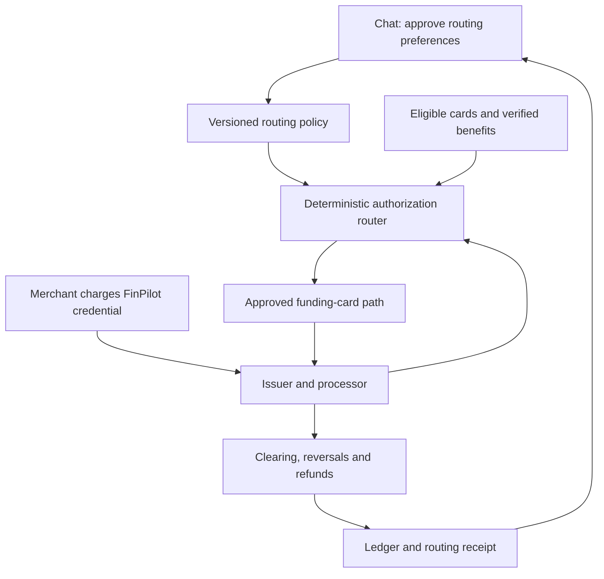

# FinPilot's two core features

Product clarification · September 14, 2026

This document defines the two primary product outcomes. It updates the priorities in [CONVERSATIONAL_FINANCE.md](CONVERSATIONAL_FINANCE.md) and [IMPLEMENTATION_PLAN.md](IMPLEMENTATION_PLAN.md). The existing conversation foundation remains the way users configure, inspect and control both features.

## 1. The product promise

**Help the user get more benefit from the financial accounts and cards they already have.**

| Core feature | User outcome | Role of AI chat |
| --- | --- | --- |
| Existing-account growth and money routing | See balances and actual account growth, compare eligible destinations, and opt into moving available money between owned accounts. | Explain performance, ask about constraints, show a transfer preview, configure automation and explain receipts. |
| One FinPilot payment credential with card routing | Save FinPilot card details at a supported merchant, then have each purchase funded by the eligible linked card with the best expected net benefit. | Add supported cards securely, set preferences and limits, explain choices, override rules and inspect rewards. |

Bills, debt, mortgage, paycheck splits, reserves, analytics and HNW ownership remain supporting features. They supply constraints and context to these two outcomes. They do not replace the primary experience.

The target is account-level cash movement and existing-card selection. The product does not choose stocks, funds or new external investment accounts. Tracking a portfolio's performance does not authorize selling its holdings, reinvesting its cash, changing its allocation or opening a financial account.

The proposed FinPilot payment credential is an explicit addition to the earlier “existing cards only” scope. It is a routing instrument for supported existing funding cards, with separate onboarding and consent. It is not a recommendation to apply for another rewards credit line. Its actual legal/product form depends on the approved issuing arrangement; that form must be disclosed before enrollment.

**Implementation status:** the current branch supplies chat, calculations, reviewed commands and sample payments. Neither autonomous live account routing nor a live FinPilot virtual-card program is implemented by this clarification. Product requirements below describe the intended implementation, not working payment capabilities.

## 2. Core feature one: account growth and opted-in cash routing

### What the user sees

Each connected account shows current and available balance, observation time, historical balance change, money added/removed and attributable earnings/performance where the source supports it. Charts allow the user to focus on one account, one platform or the household and compare equal periods.

Examples of intended chat requests:

- “Which of my accounts earned the most this month, excluding deposits?”
- “Compare the growth of these two accounts over the same period.”
- “Where could my spare cash earn more among my current accounts?”
- “Keep at least $2,000 in checking and suggest where the excess should go.”
- “Enable transfers among these two savings accounts when the net improvement exceeds my threshold.”
- “Why did you move that money, and how much additional interest has actually been earned?”

### Define growth before ranking accounts

An account rising from $10,000 to $15,000 after a $5,000 deposit has not earned a 50% return. An investment account rising in value does not establish the yield of uninvested cash deposited into it. A transfer from one owned account to another changes each account's balance but is not household income or household growth.

For one account over a reconciled period:

`residual change = closing value − opening value − contributions + withdrawals`

This identity isolates change that is not explained by recorded external cash flows at that account boundary. It can include interest, dividends, market valuation, fees, taxes, currency movement and unexplained data gaps. It is not automatically a pure return percentage. Report those components separately where data permits and label an unresolved residual.

| Metric | Meaning | Use in routing |
| --- | --- | --- |
| Balance change | Closing minus opening value. | Display only; cannot establish earnings. |
| Contributions and withdrawals | Dated flows into/out of the account, including owned-account transfers at account level. | Remove their effect from growth comparisons; eliminate both sides for household consolidation. |
| Interest actually credited/accrued | Interest amount with source and period. | Historical evidence; check the rate currently available for new cash. |
| Current cash yield | Verified APY, tiers, caps, eligibility, fees and effective dates. | Estimate marginal earnings for a proposed transfer over a common horizon. |
| Portfolio performance | Provider-reported or calculated return with method, period and flow treatment. | Historical analytics; do not equate it to the yield of a new cash deposit. |
| Available transferable cash | Amount that can leave after holds, reservations, constraints and settlement. | Upper bound on a transfer, not total portfolio value. |

Use time-weighted or money-weighted performance only when the necessary valuations/dated flows exist and disclose the method. A single current balance cannot produce a growth history. Compare like currencies or explicitly separate FX effects. When data is incomplete, report “insufficient history” instead of inventing a return.

### Choose the best eligible destination for the proposed amount

“Maximum growth” becomes a constrained calculation: maximize the expected incremental net earnings of available cash among user-eligible existing destinations, while protecting bills and liquidity. The result is an estimate under current terms, not a guarantee of future growth.

Filter candidate routes for verified ownership, transfer capability, same permitted legal entity, withdrawal access, currency, amount/cap limits and the user's approved scope. Then compare the **marginal** yield on the transferred amount: a headline bonus rate capped at the first $1,000 may provide no additional benefit to a destination already holding that amount.

Estimate the stay-versus-move difference over the same dates, including current rate terms, compounding, transfer delay, fees, any verified tax difference and the balance remaining at the source. Do not automatically treat a CD as instantly available or a brokerage's invested value as cash. A brokerage destination is evaluated using the actual treatment of incoming cash, including a verified existing default sweep arrangement where applicable.

The first automatic routing release should use supported cash accounts whose destination treatment is known. Other portfolios remain visible in the growth comparison; their past performance alone cannot trigger an automated cash move. Changing a portfolio's investments remains outside this product scope.

### Consent and execution

Offer three separate modes:

1. **Observe:** show growth and comparisons, with no financial action.
2. **Review each move:** prepare an exact source/destination/amount/fee/date preview; execute only after confirmation.
3. **Approved automation:** the user confirms a bounded standing rule once; subsequent eligible moves can execute without another chat confirmation for every transfer.

A standing rule names permitted accounts, protected floors, spending/bill reserves, per-transfer and period caps, minimum expected improvement, maximum fees, freshness requirements, start/end, notification preferences and pause/revocation. A generic “yes” or “maximize growth” is insufficient to establish all these parameters. Changing them materially needs fresh approval.

Use hysteresis, minimum holding time and economic thresholds to prevent constant back-and-forth transfers after tiny rate changes. Re-evaluate before submission. A pending card repayment, payroll delay or unexpected bill can eliminate the surplus. Maintain an atomic reservation so concurrent transfer proposals cannot use the same cash twice.

Execute with the existing planned payment-intent/outbox architecture. Record submitted, processing, settled, returned and failed states. Reconcile uncertain outcomes before retrying. Show realized additional earnings separately from projected earnings; do not attribute unrelated account growth to the app's transfer.

### Implementation modules and acceptance checks

| Proposed module | Responsibility | Required acceptance check |
| --- | --- | --- |
| `growth/observations.py` | Dated valuations, balances, terms and source references. | Missing dates/history cannot produce fabricated growth. |
| `growth/performance.py` | Flow-adjusted changes and method-labeled returns. | A pure deposit produces zero unexplained earnings; an owned transfer does not inflate household growth. |
| `growth/routing.py` | Eligible destinations and marginal net-earnings comparison. | Tier saturation, fees, transfer delay and protected cash can change the winner. |
| `growth/policies.py` | Bounded opt-in rules, versioning and revocation. | A revoked or materially changed rule cannot execute under old consent. |
| Existing `conversation/` | Questions, graphs, rule previews and explanations. | User can inspect and change the rule through chat without model-generated financial figures. |
| Future execution worker | Reservations, provider submission and reconciliation. | Duplicate triggers or network retries produce one financial transfer intent. |

These are proposed module boundaries, not directories already delivered. Integrate them with `engine/liquidity.py`, existing tax/ledger services and the household unit of work rather than creating another ledger.

## 3. Core feature two: a single merchant-facing card

### Intended experience

The user securely links supported existing cards, receives a FinPilot payment credential, and saves its details with Uber, Lyft, Netflix or another supported merchant. A merchant charges FinPilot's credential. The approved payment program routes the transaction to the chosen eligible funding card, taking current benefits and user preferences into account. The user sees which underlying card funded it and why.

| Hypothetical transaction | Routing decision |
| --- | --- |
| Uber ride | Select the linked card with the best verified net ride benefit for this transaction. Uber Eats is evaluated separately. |
| Lyft ride | Consider its merchant-specific eligibility and credits; the Uber winner need not win here. |
| Netflix renewal | Choose among cards verified to earn applicable benefits through the approved recurring-payment route. |
| Hotel booking | Consider booking channel, benefit eligibility, expected holds/incremental amounts and total fees. |
| General purchase | Use the best eligible base benefit, or the user's explicit default if evidence is insufficient. |

These examples contain no claim about a particular issuer's current reward rate. Actual rules must be sourced and versioned. Credit-card purchases create obligations on the funding credit account; they do not mean money has already left checking. Feed those obligations back into the cash-routing buffer so earning interest never makes repayment unaffordable.

A program may offer merchant-specific virtual aliases for privacy and easier replacement, all controlled by the same FinPilot routing policy. That is optional; the essential outcome remains one FinPilot payment setup instead of asking users to repeatedly change their underlying card at every merchant.

### Feasibility: the payment program is the critical dependency

There is a real product precedent. Curve's official documentation describes adding multiple cards and using category/amount rules to select a funding card. Its published offering describes UK/EEA operation. This demonstrates the pattern; it is not evidence that FinPilot has access to a US Curve API or that all card issuers/networks are supported. [Curve: how it works](https://www.curve.com/how-it-works/), [Curve Smart Rules](https://www.curve.com/smart-rules/).

Visa Flex Credential provides a network-level implementation path for participating issuers. The public documentation specifically describes multiple accounts **from a single issuer**, issuer enrollment and pre-set funding choices/rules. It does not establish that FinPilot can combine arbitrary existing cards from different banks. Assess it as an issuer-partner option, not a universal cross-issuer solution. [Visa Flex Credential](https://developer.visa.com/capabilities/visa-flexible-credential).

An issuing processor can provide real-time authorization controls. For example, Marqeta's JIT documentation describes transaction-time program funding and gateway approve/deny decisions. That capability alone is not a contract to charge arbitrary third-party credit cards while retaining the original merchant's rewards. The issuing relationship and underlying funding path must both support the use case. [Marqeta JIT funding](https://www.marqeta.com/docs/developer-guides/about-jit-funding).

| Approach | Fit for the requested product | Decision |
| --- | --- | --- |
| Approved cross-issuer proxy-card program | Closest to one credential backed by the user's existing cards from different issuers. | Target architecture; obtain explicit US issuer/network/processor support and validate issuer reward treatment. |
| Issuer-backed flexible credential | Can route between supported accounts in the participating issuer's program. | Viable narrower launch if coverage is clear to users; not proof of arbitrary multi-bank support. |
| Merchant-integrated wallet/checkout selection | Can select an underlying card where the merchant supports the integration. | Limited coverage path; recurring and native-app behavior must be verified per merchant. |
| Issued prepaid/debit card topped up by a credit-card charge | Creates separate merchant and funding transactions. | Does not establish preservation of original merchant benefits. Do not use this as an unverified substitute. |
| Advisory card picker or browser extension | Helps choose a card but does not control arbitrary native-app renewals. | Useful interim feature, but does not complete the user's single-card requirement. |

### Preserve eligibility, not just a category label

Passing the original merchant category can matter, but it is not sufficient to guarantee every benefit. Merchant identity, direct-booking conditions, wallet/channel exclusions, geography, enrollment, issuer rules and transaction treatment can change eligibility. Never forge merchant data or describe a funding/top-up charge as the original purchase.

For example, Chase's category FAQ says third-party technology must process a purchase in the qualifying category for it to receive that category's rewards; it also distinguishes direct purchases from some intermediary purchases. Test the complete payment path for each claimed benefit. Do not advertise automatic preservation of all bonuses. [Chase rewards category rules](https://www.chase.com/personal/credit-cards/rewards-category-faq).

Maintain a compatibility record per program, funding-card product/network, merchant/channel and benefit type. Record supported payment behavior, category/merchant fidelity, reward evidence, issuer-source date, settlement/refund behavior and any limits. Unknown compatibility means no bonus claim; user-approved default routing or a decline is preferable to an invented guaranteed result.

Sign-up or threshold bonuses require special handling. Do not count an entire possible bonus as the reward for one purchase or encourage unnecessary spending. Track eligible progress, deadline, reversals and remaining conditions; show a conditional contribution to the target. Do not apply for a new card.

### Route quickly with deterministic policy

The payment authorization handler should not wait for a language model, retrieve webpages or load a financial conversation. Chat compiles user preferences into an approved, versioned policy ahead of time. The authorization handler uses bounded local data and an issuer/processor-approved response budget.

This is the proposed integration topology. Network-managed and issuer-managed programs can place the decision in different systems; FinPilot must implement the selected partner's actual protocol.

Filter cards for ownership, program eligibility, current status, merchant/currency acceptance, user exclusions, available credit constraints and repayment conditions. Rank feasible cards by expected **net** benefit: earned rewards and usable incremental credits minus fees, incremental interest and lost discounts, with uncertainty shown. A raw points multiplier is not a cash value without a disclosed redemption assumption.

Authorization data may include merchant/category indicators, transaction amount and whether the event is an original authorization or an incremental request. Normalize only what the provider supplies; a descriptor is not always a reliable brand identity. Account verification requests are not purchases. [Marqeta transaction data](https://www.marqeta.com/docs/core-api/transaction-data-for-jit-funding-decisions).

### Recurring payments and lifecycle details

Link the original merchant transaction, funding authorization, clearing events and receipts. Pin an authorization lifecycle to its chosen funding route: a later tip, hotel adjustment, partial capture, reversal or refund must follow the approved program's rules and original linkage, not be re-optimized as an unrelated new purchase.

A new Netflix billing cycle may choose a different eligible card under the standing policy if the program supports that recurring flow. Stored credential and merchant-initiated-transaction indicators must remain correct. Card replacement, network-token refresh, cancellation and merchant updater behavior require partner support.

Fallback applies only to specifically allowed cards and conditions. A definitive decline can lead to a supported fallback attempt; a timeout or unknown first outcome must not cause a blind charge to another card. Out-of-order events, duplicate callbacks, late clearing and refunds must be replay-safe. Preserve the dispute path and show the user the original funding card even after it has been removed from future routing.

Use provider-hosted tokenization for underlying card entry. Keep token references and masked labels in FinPilot's application data and prompts; no underlying PAN/CVV in chat. Do not store underlying-card CVVs for later subscription charges. PCI SSC explicitly prohibits that service-provider storage even with customer permission. Any issuing-side exception belongs within an assessed issuing system, not the chat backend. [PCI SSC FAQ 1574](https://www.pcisecuritystandards.org/faqs/1574/).

## 4. Work that must start now

Reorder the previous implementation roadmap around both core tracks. Do not postpone the card-program feasibility investigation until after all budgeting or HNW features are complete.

| Track | Next concrete deliverable | Done when |
| --- | --- | --- |
| Account observations | Dated balance/term observations and flow-adjusted growth service with scoped chat charts. | Deposit, withdrawal, own-transfer, missing-history and currency scenarios are correct. |
| Cash routing | Existing-destination comparison, clear marginal earnings and reviewed transfer proposals. | The proposed move respects reserves, bill/card repayment needs, fees and current destination treatment. |
| Opted-in automation | Versioned standing rules, eligible trigger identity, reservations and durable worker. | Revocation, duplicate triggers and unknown payment outcomes cannot produce unauthorized or repeated moves. |
| Card-program feasibility | Written capability matrix from prospective US issuer/network/processor arrangements. | Cross-issuer support, credit-card funding, original-merchant rewards, recurring payments, refunds, liability and economics are actually established. No provider outreach is performed by this document. |
| Card policy simulator | Extend the existing rewards engine with merchant compatibility, caps, user exclusions and deterministic routing receipts. | Synthetic Uber/Lyft/Netflix/hotel cases choose the expected eligible card and handle uncertainty; no real card is charged. |
| Issued credential integration | Sandbox credential issuance/tokenization and approved funding/authorization path. | An end-to-end supported purchase, renewal, decline, refund and duplicate-event test reconcile correctly. |

The first two tracks can build on the current monolith. Live card authorization is a separate latency-critical module/process boundary when integrated; it shares typed policy and ledger contracts, not the model request path. Financial recommendations, policy setup and outcome explanations stay in chat.

## 5. Questions for prospective payment partners

These are implementation questions for the future partner evaluation, not assumptions that any listed provider has agreed to the design:

1. Does this US program permit one merchant-facing credential to fund from existing consumer credit cards at different issuers? Which issuers, networks and card products are supported?
2. What exactly appears on the funding card: merchant, category, country, transaction type and amount? Which rewards/credits survive that route, and how can that be verified?
3. Who issues the credential, holds the settlement obligation, supplies funding, and owns fraud, chargebacks, returns and negative balances? What are the per-transaction and program costs?
4. Are recurring and merchant-initiated payments, zero-amount checks, tips, incremental hotel authorizations, partial captures and delayed clearing supported?
5. Can the same stored merchant credential choose a new funding card for a later billing cycle? What are the rules for declines, unknown outcomes, fallback and refunds?
6. Which tokenization, stored-credential, authorization-latency, availability and certification requirements apply? What must be tested before production?

Public documentation establishes useful patterns and limits. It does not replace these written program answers or end-to-end reward verification. The product should promise automatic selection of the best **eligible** route under current verified conditions, and show the outcome honestly.
